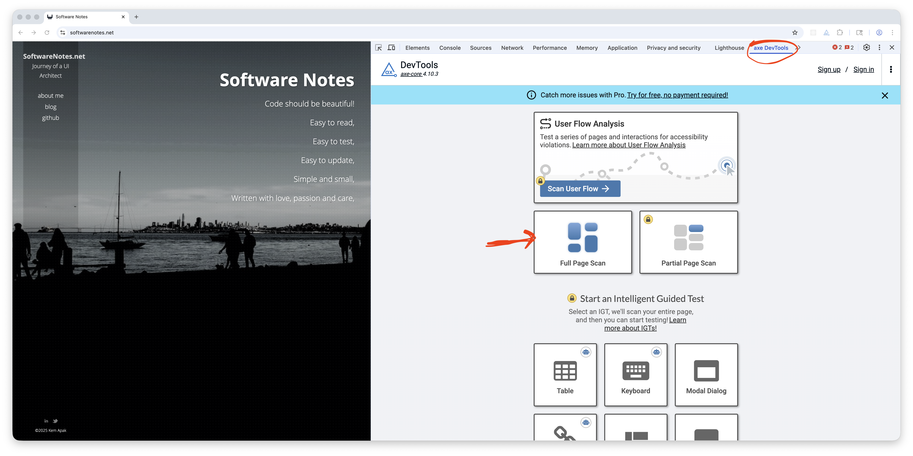

# AXE

AXE DevTools is an excellent browser extension for identifying accessibility (a11y) issues, including coding errors and 
color contrast problems. It’s simple to set up, easy to use, and provides helpful guidance on how to fix the issues it 
detects. 

## Chrome Setup
1. Install the [AXE DevTools Web Accessibility Extension](https://chromewebstore.google.com/detail/axe-devtools-web-accessib/lhdoppojpmngadmnindnejefpokejbdd?hl=en-US) from the Chrome Web Store.
2. Once installed, verify that the extension is **enabled** in [chrome://extensions/](chrome://extensions/)
3. Open Chrome DevTools and look for the **AXE** tab in the top menu.
   - If AXE doesn’t appear, try visiting a different site or restarting Chrome.
4. When prompted, select your role and accept the terms and conditions.

## Using AXE
1. Open Chrome DevTools (**Option** + **Command** + **i** on macOS).
2. Select **AXETools** tab.
3. Click **Full Page Scan** to analyze the page for accessibility issues.
> For additional details, see the official [AXE documentation](https://axe.deque.com/install-success)

