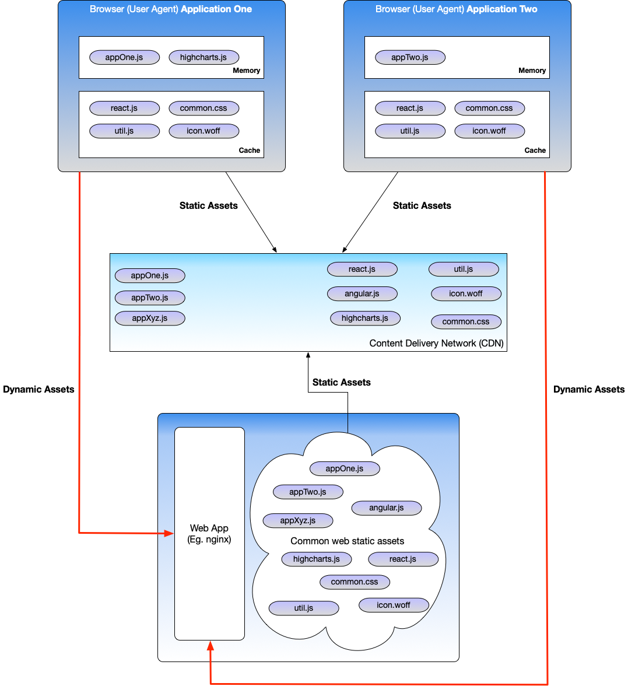

# Common UI asset release strategy

## Overview
As of this writing, many UI engineers and architects rely heavily on popular bundling tools and framework defaults for 
code bundling decisions. While these tools (and techniques such as tree-shaking or module federation) can be beneficial, 
they are often adopted without a deliberate strategy. The result is unnecessarily large bundles, redundant downloads, 
and suboptimal performance.

This document presents an opinionated perspective: critical decisions that affect application performance, caching, 
and bundle size should **not** be delegated entirely to tools or frameworks. This consideration is especially important 
for micro frontends (MFE) and single-page applications (SPA), where bundle duplication is common.

## Terms
**Cache**
A temporary storage layer that holds frequently accessed data in memory to improve performance.

**Browser Cache (Primary Cache)**
The internal cache used by browsers to store static UI assets (JavaScript, CSS, images, fonts, etc.) for faster access 
on subsequent visits. When multiple applications reference identical assets using the exact same URL, the browser only 
downloads them once. Browsers use internal heuristics to determine caching behavior based on frequency, asset size, 
and memory availability.

_Example_:
If angular.js is served from the same URL for Application A and Application B, for example, `https://assets.example.com/angular.js`, 
it will be downloaded only once and reused across both applications.

**CDN (Content Delivery Network)**
A distributed proxy network that caches static assets geographically closer to users to reduce latency and offload 
requests from origin servers.

**UI Bundles**
The result of build processes that combine and optionally optimize static UI assets. While bundling can improve 
performance by reducing network requests, poor strategy can lead to bloated bundles and redundant downloads.

**Static UI Assets**
Everything except HTML is generally considered static. These assets are excellent candidates for caching.
Static resources required to render and operate a web page or application (JavaScript, CSS, fonts, images, JSON, etc.).

**Dynamic UI Assets**
HTML is typically dynamic and not cached. To improve page performance:
- keep HTML minimal
- externalize inline CSS and JavaScript
- leverage web components and reusable templates

**Browser Cold** (Load)
A first-time page load in a browser where no relevant assets are cached.

**Browser Warm** (Load)
A subsequent load where cached static assets are reused, drastically reducing download requirements.

## Objective
Currently, applications often bundle common frameworks and libraries directly into their builds. This yields:
- large bundle sizes
- redundant downloads
- slower load performance
- poor use of browser caching
- limited ability to load third-party libraries on demand
- downloading the same framework repeatedly if bundled independently per application

## Proposed Solution
As a frontend architect, I recommend externalizing common internal and third-party UI libraries from application 
bundles and hosting them in the cloud behind a CDN. Applications then reference these assets directly at runtime.

This approach enables:
- improved caching behavior
- reuse of shared libraries
- reduced bundle sizes
- ability to load libraries on demand
- centralized governance



## Performance Improvements
This strategy enhances performance for both cold and warm loads:
- **Application bundle**: Reduces application bundle size; omitting framework and common library assets out.
- **Browser Cold load**: Multiple smaller assets can be downloaded in parallel per application.
- **Browser Warm load**: Already-cached libraries are reused across applications. Only loading application specific bundle.
As a side benefit, dynamic loading becomes feasible, allowing applications to load only what they need, when they need it.

## Central Control
Externalizing common assets provides a single point of control for:
- library versioning
- deprecation timelines
- patching and security fixes
- performance optimization efforts

## Uploading Files
We will collaborate with DevOps to upload bundled files to a static asset storage location and ensure they are served 
via a CDN.

Recommended structure (grouped by library name and version):
```text
\library-name
    \version # (major.minor.patch - Semantic Versioning unless the third party differs) 
```
_Example_:
```text
\react
    \19.2.0
        react.production.min.js
        react-dom.production.min.js
        
\angular
    \18.0.3
        angular.min.js
    \20.1.12
        angular.min.js
        
\highcharts
    \11.4.0
        highcharts.js
    \12.4.0
        highcharts.js
        
\util
    \tokenManager
        \1.2.3
            tokenManager.js
            
\style
    \1.0.0
        \asset
            logo.svg
            logo-color.svg
            favicon.ico
        \font
            abc.woff
        \icon
            icon.woff        
        common.css
        
\component
    \form
        \2.2.11
            \assets
                abc.svg                
            component.css
            component.js            
    \dataVisualization
        \1.0.1
            \assets
                abc.svg
            component.css
            component.js            
    \multiMedia
        \1.0.0
            \assets
                abc.svg
            component.css
            component.js
    \common
        \1.3.3              
            \assets
                abc.svg
            component.css
            component.js
        \2.0.1
            \assets
                abc.svg
            common-component.css
            commonComponent.js
    \util
        \2.3.12
            util.js
            
\businessUnitOne
    # Common assets
    
\businessUnitTwo
    # Common assets
```

## Builds, Security and UI Access
- Each internal or third-party library will be **bundled individually** (most third-party libraries already are).
- **Subresource Integrity (SRI)** will be implemented :
  - checksum files (e.g., `sha512`) will be generated during the build,
  - script and link tags will include `integrity` attributes to ensure content has not been tampered with.

_Example_:
```html
<script
  src="..."
  integrity="sha384-4bw+/aepP/YC94hEpVNVgiZdgIC5+VKNBQNGCHeKRQN+PtmoHDEXuppvnDJzQIu9">
</script>
```
- Cloud access will be controlled:
 - External access occurs only through a CDN,
 - Upload privileges remain internal.

## Conclusion
This approach will benefit
Summary of Benefits
- Reduced bundle sizes
- Faster cold and warm loads
- Better reuse of common libraries
- On-demand loading capabilities
- Centralized version and security management
- Better use of existing browser cache behavior

## References
- (Subresource Integrity - Security | MDN)[https://developer.mozilla.org/en-US/docs/Web/Security/Subresource_Integrity]
- (Subresource Integrity)[https://en.wikipedia.org/wiki/Subresource_Integrity]
- (How to generate and verify file checksums on Linux)[https://www.a2hosting.com/kb/developer-corner/linux/working-with-file-checksums/] 